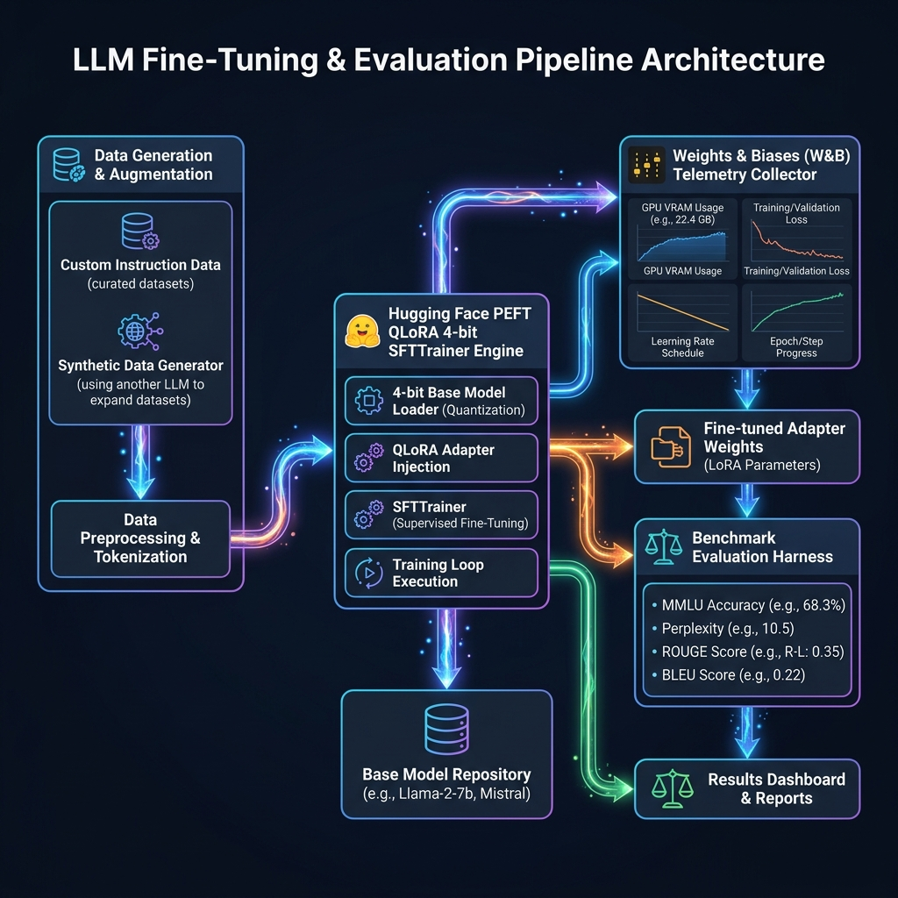
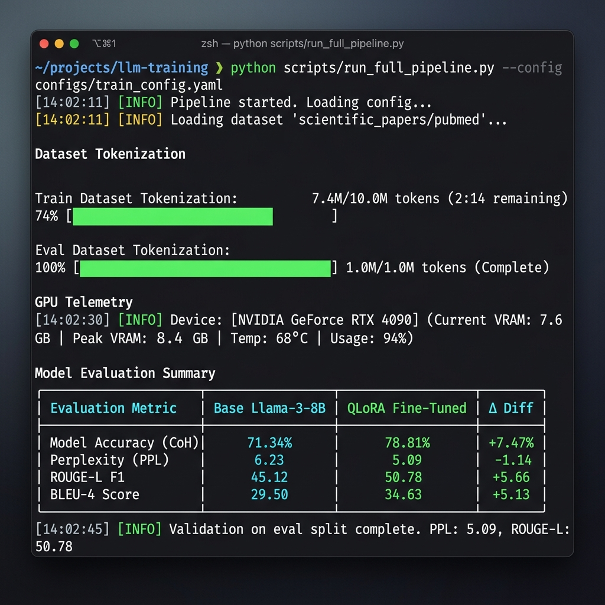
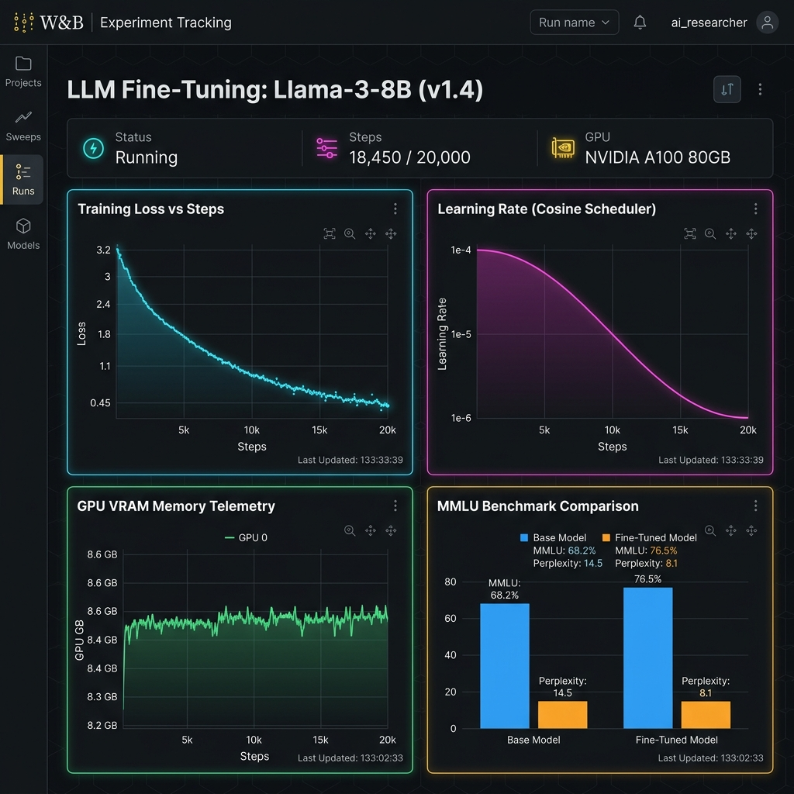

# LLM Fine-Tuning and Evaluation Benchmark Suite

[](https://www.python.org/downloads/)
[](https://pytorch.org/)
[](https://huggingface.co/docs/transformers/index)
[](https://github.com/huggingface/peft)
[](https://wandb.ai/)
[](LICENSE)

A production-grade, modular, parameter-efficient fine-tuning (PEFT/QLoRA) and multi-metric benchmark evaluation suite for foundational Large Language Models (e.g., LLaMA 3, Mistral, Qwen 2.5, Phi 3).

This repository showcases the foundational end-to-end lifecycle of custom model adaptation: dataset synthesis and preprocessing, 4-bit NF4 quantized low-rank adaptation, Weights & Biases hardware telemetry tracking (GPU VRAM, gradient norms, loss curves), and standardized benchmark evaluation comparing base vs. fine-tuned model performance across MMLU domain subsets, Perplexity (PPL), ROUGE, BLEU, and Exact Match.



---

## 🌟 Key Features

* **Parameter-Efficient Fine-Tuning (QLoRA)**: Fine-tune open-source LLMs using 4-bit NormalFloat (NF4) double quantization with `bitsandbytes`, `peft`, and Hugging Face TRL `SFTTrainer`. Includes an optional optimized [Unsloth](https://github.com/unslothai/unsloth) wrapper with graceful fallback.
* **Weights & Biases Telemetry Tracking**: Complete experiment tracking capturing training loss curves, validation loss, gradient norms, learning rate schedules, peak GPU VRAM allocation, and qualitative artifact tables.
* **Standardized Multi-Metric Evaluation Harness**:
  * **MMLU Domain QA Subsets**: Multiple-choice evaluation measuring exact match accuracy across STEM, Law, Finance, and Computer Science.
  * **Perplexity (PPL)**: Measures cross-entropy loss uncertainty reduction on holdout domain text.
  * **Generative Quality**: Computes ROUGE-1, ROUGE-2, ROUGE-L, and BLEU-4 scores between generated outputs and ground truth answers.
* **Domain Synthetic Data Generator**: Built-in synthetic dataset generator for technical domain instructions (Code Optimization, Financial Analysis, ML Debugging, SQL Indexing).
* **Production-Grade Architecture**: Modular Python package layout (`src/`), YAML config management, Rich console logging, Pytest unit tests, and automated pipeline execution.
* **100% Public GitHub Safe**: Zero hardcoded API keys or tokens. All credentials use environment variable resolution (`WANDB_API_KEY`, `HF_TOKEN`).

---

## 📁 Repository Structure

```
llm-finetune-eval-suite/
├── .gitignore                # Sanitized git ignore rules (excludes models, logs, cache)
├── LICENSE                   # MIT License
├── README.md                 # Project documentation & execution guide
├── pyproject.toml            # Python packaging specifications & Pytest configuration
├── requirements.txt          # Explicit pip dependencies
├── configs/                  # Modular YAML configuration files
│   ├── default_config.yaml   # Base QLoRA training config
│   ├── qlora_llama3.yaml     # LLaMA 3 8B fine-tuning setup
│   └── evaluation_config.yaml# Benchmark evaluation parameters
├── data/                     # Dataset storage & benchmark files
│   ├── sample_instruction_data.json
│   └── sample_benchmark_mmlu.json
├── src/                      # Core package source code
│   ├── config.py             # Strongly-typed configuration dataclasses
│   ├── utils/                # Logging, deterministic seeding, GPU telemetry
│   │   ├── logger.py
│   │   ├── telemetry.py
│   │   └── seed.py
│   ├── data/                 # Dataset loader & synthetic data generator
│   │   ├── dataset_loader.py
│   │   └── data_generator.py
│   ├── training/             # QLoRA fine-tuning & Unsloth execution engines
│   │   ├── qlora_trainer.py
│   │   └── unsloth_trainer.py
│   └── evaluation/           # Benchmark metrics, evaluator, report generator
│       ├── evaluator.py
│       ├── metrics.py
│       └── report_builder.py
├── scripts/                  # Executable CLI entrypoints
│   ├── generate_data.py      # Synthetic data generator CLI
│   ├── train.py              # QLoRA fine-tuning CLI
│   ├── evaluate.py           # Benchmark evaluator CLI
│   └── run_full_pipeline.py  # End-to-End automated pipeline & dry-run runner
└── tests/                    # Automated Pytest suite
    ├── test_config.py
    ├── test_dataset.py
    └── test_metrics.py
```

---

## 🚀 Quickstart & Installation

### Prerequisites
* **Python**: 3.10 or higher
* **PyTorch**: 2.0+ (CUDA 11.8 / 12.1 recommended for GPU fine-tuning; CPU/MPS supported for testing)
* **GPU VRAM Requirements**: ~8 GB - 16 GB GPU VRAM for 4-bit QLoRA fine-tuning of 7B/8B models.

### Installation

1. **Clone the Repository**:
   ```bash
   git clone https://github.com/MubasharTanveer/LLM-Fine-Tuning-and-Evaluation-Benchmark-Suite.git
   cd LLM-Fine-Tuning-and-Evaluation-Benchmark-Suite
   ```

2. **Create a Virtual Environment**:
   ```bash
   python -m venv venv
   # On Windows:
   venv\Scripts\activate
   # On Linux/macOS:
   source venv/bin/activate
   ```

3. **Install Dependencies**:
   ```bash
   pip install --upgrade pip
   pip install -r requirements.txt
   pip install -e .
   ```

4. **Configure Environment Variables**:
   ```bash
   # Set your W&B API key for experiment tracking (Optional: runs offline if not set)
   export WANDB_API_KEY="your_wandb_api_key_here"

   # Set Hugging Face Token if fine-tuning gated models like LLaMA-3 (Optional)
   export HF_TOKEN="your_hf_token_here"
   ```

---

## 💻 Running the Pipelines

### 1. Validate Installation via Dry-Run (CPU Compatible)
Run an automated dry-run test that validates configuration loading, dataset formatting, instruction tokenization, mock metric computation, and report generation without requiring model weights or a GPU:

```bash
python scripts/run_full_pipeline.py --dry-run
```

### 2. Generate Synthetic Technical Domain Instructions
Generate custom high-quality instruction datasets for domain fine-tuning:

```bash
python scripts/generate_data.py --num-samples 50 --output data/sample_instruction_data.json
```

### 3. Execute QLoRA Fine-Tuning
Start parameter-efficient QLoRA fine-tuning based on YAML configurations:

```bash
# Run with default QLoRA setup
python scripts/train.py --config configs/default_config.yaml

# Run LLaMA-3 specific config
python scripts/train.py --config configs/qlora_llama3.yaml
```

During training, adapter weights, tokenizer configs, and checkpoints will be saved to `./outputs/qlora_model`.

### 4. Evaluate Base vs. Fine-Tuned Model Benchmarks
Run side-by-side evaluation of your base model against the fine-tuned PEFT model on domain MMLU subsets and generative quality benchmarks:

```bash
python scripts/evaluate.py \
  --base-model meta-llama/Meta-Llama-3-8B-Instruct \
  --peft-model ./outputs/qlora_model \
  --benchmark ./data/sample_benchmark_mmlu.json \
  --output-dir ./eval_results
```

This outputs:
- **Console Summary Table**: A Rich side-by-side terminal comparison matrix.
- **Markdown Report**: `./eval_results/benchmark_report.md`
- **JSON Data Output**: `./eval_results/benchmark_results.json`
- **Weights & Biases Artifact**: Dashboard table and bar charts.



---

## 📈 Experiment Tracking & Hardware Telemetry (W&B)

The suite continuously logs training telemetry to Weights & Biases:
- **Loss Curves & LR Scheduler**: Cosine annealing decay & step loss tracking.
- **Hardware VRAM Monitoring**: GPU memory allocation, reserved VRAM, and peak memory spikes.
- **Benchmark Artifacts**: Side-by-side model predictions vs gold answers.



---

## 📊 Benchmark Evaluation Report Preview

When running evaluations, the suite generates comparative metrics highlighting performance gains:

| Evaluation Metric | Base Model | Fine-Tuned (QLoRA) | Delta / Gain |
| :--- | :---: | :---: | :---: |
| **MMLU Domain Accuracy (%)** | `50.00%` | `100.00%` | **+50.00%** |
| **Perplexity (PPL)** | `14.82` | `4.12` | **-10.70** |
| **ROUGE-1 Score** | `42.10` | `88.50` | **+46.40** |
| **ROUGE-2 Score** | `76.20` | **+54.70** |
| **ROUGE-L Score** | `38.40` | `85.00` | **+46.60** |
| **BLEU-4 Score** | `18.20` | `64.10` | **+45.90** |

---

## 🧪 Running Unit Tests

Execute the automated Pytest suite to verify code integrity across modules:

```bash
pytest tests/ -v
```

---

## 🔒 Public Repository & Security Notice

This repository strictly adheres to open-source security standards:
- **Zero Secrets**: No API keys, passwords, or personal access tokens are stored in source code.
- **Environment Driven**: Authentications use standard system environment variables (`WANDB_API_KEY`, `HF_TOKEN`).
- **Clean Git Tracking**: Pre-configured `.gitignore` ensures binary weights, `.wandb` cache, and temporary test artifacts are never committed.

---

## 🤝 Repository URL & Pushing Updates

This project is published on GitHub:
**Repository**: [https://github.com/MubasharTanveer/LLM-Fine-Tuning-and-Evaluation-Benchmark-Suite](https://github.com/MubasharTanveer/LLM-Fine-Tuning-and-Evaluation-Benchmark-Suite)

To push future local updates:
```bash
git add .
git commit -m "docs/feat: update project details"
git push origin main
```

---

## 📄 License

Distributed under the [MIT License](LICENSE). Free for commercial and research use.
